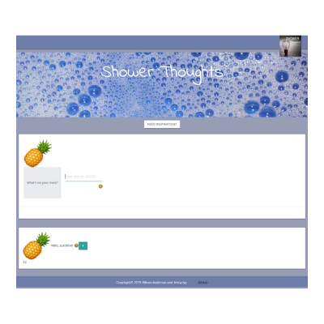
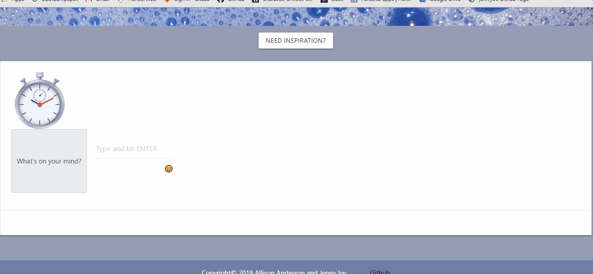

# Project # 3 - "Shower Thoughts"
**Creators**: `Jenny Ivy and Allison Anderson`
- - -

• Link to deployed version: https://shower--thoughts.herokuapp.com/

• Link to code on GitHub: https://github.com/aaanderson1/project3-2

## Overview:

This is a messaging app created with React. Users are assigned a unique avatar during login, which does not require a username or password. Inside the app, users can comment anonymously, delete if they wish, and read other users' comments. Each post expires after 60 seconds. 

An emoji library and quote generator help keep the messages engaging.

## Technology Used: 

*React 
*React Router  
*Node  
*Express  
*MongoDB  
*Mongoose  
*Sass  
*React-Bootstrap  
*React-Materialize  
*Emoji-Mart for React  

